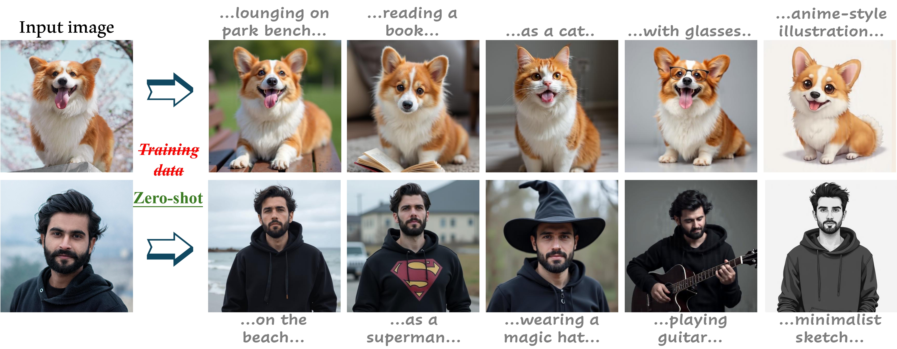

<div align="center">
<h1>FreeCus: Free Lunch Subject-driven Customization in Diffusion Transformers</h1>


[Yanbing Zhang](https://openreview.net/profile?id=~Yanbing_Zhang2) · [Zhe Wang](https://openreview.net/profile?id=~Zhe_Wang15) · [Qin Zhou](https://openreview.net/profile?id=~Qin_Zhou3) · [Mengping Yang](https://openreview.net/profile?id=%7EMengping_Yang2)

[zhangyanbing@mail.ecust.edu.cn](mailto:zhangyanbing@mail.ecust.edu.cn)

<a href='https://github.com/Monalissaa/FreeCus'></a>
<a href='http://arxiv.org/abs/2507.15249'></a>

</div>

> **TL; DR:**  ***FreeCus*** is a **genuinely** training-free framework that activates DiT’s capabilitie for subject-driven customization.

 


## Abstract 
Existing alternatives typically require either per-subject optimization via trainable text embeddings or training specialized encoders for subject feature extraction on large-scale datasets. Such dependencies on training procedures fundamentally constrain their practical applications. More importantly, current methodologies fail to fully leverage the inherent zero-shot potential of modern diffusion transformers (e.g., the Flux series) for authentic subject-driven synthesis. We propose ***FreeCus***, a **genuinely training-free** framework that activates DiT's capabilities through three key innovations: 1) We introduce a pivotal attention sharing mechanism that captures the subject's layout integrity while preserving crucial editing flexibility. 2) Through a straightforward analysis of DiT's dynamic shifting, we propose an upgraded variant that significantly improves fine-grained feature extraction. 3) We further integrate advanced Multimodal Large Language Models (MLLMs) to enrich cross-modal semantic representations. Extensive experiments reflect that our method successfully unlocks DiT's zero-shot ability for consistent subject synthesis across diverse contexts, achieving state-of-the-art or comparable results compared to approaches that require additional training. Notably, our framework demonstrates seamless compatibility with existing inpainting pipelines and control modules, facilitating more compelling experiences.

 

## 🔥 Latest News

* Jul 22, 2025: 🔥🔥 Our code is released, try yourself with the unbonded creativity of DiT foundation models!
* Jul 22, 2025: We release the [Technique-Report](http://arxiv.org/abs/2507.15249) of **FreeCus**.


## Installation
We recommend using Python 3.10 and PyTorch with CUDA (we use 12.4) support. To set up the environment:

```
# Create a new conda environment
conda create -n freecus python=3.10
conda activate freecus

# Install other dependencies
pip install -r requirements.txt
```

## Download
You can ​download models directly from Hugging Face. This includes [black-forest-labs/FLUX.1-dev](https://huggingface.co/black-forest-labs/FLUX.1-dev), [Qwen/Qwen2-VL-7B-Instruct](https://huggingface.co/Qwen/Qwen2-VL-7B-Instruct), [Qwen/Qwen2.5-7B-Instruct](https://huggingface.co/Qwen/Qwen2.5-7B-Instruct), and [ZhengPeng7/BiRefNet](https://huggingface.co/ZhengPeng7/BiRefNet).

## Quickstart
```
python3 infer.py --qwen2_vl_path {The path of model Qwen2-VL} \
                 --qwen2_5_path {The path of model Qwen2.5} \
                 --birefnet_path {The path of model BiRefNet} \
                 --flux_path {The path of model Flux.1-dev} \
                 --input_image 'assets/stork.jpg' \
                 --prompt "A stork with glowing wings dancing on the waves of the northern lights" \
                 --subject_word 'stork' 
```

## BibTeX
```
@article{zhang2025freecus,
  title={FreeCus: Free Lunch Subject-driven Customization in Diffusion Transformers},
  author={Zhang, Yanbing and Wang, Zhe and Zhou, Qin and Yang, Mengping},
  journal={Proceedings of the IEEE/CVF international conference on computer vision},
  year={2025}
}
```

## Limitations
The produced results might sometimes have unsatisfactory artifacts since our method enabels zero-shot customization within the DiT foundation model in a totally training-free manner. Moreover, our method inherits the foudation models' intrinsic limitations such as very complex instruction following and customization for very rare objects.

## Disclaimer
This project is released for academic use. We disclaim responsibility for user-generated content. Users are solely liable for their actions. The project contributors are not legally affiliated with, nor accountable for, users' behaviors. Use the generative model responsibly, adhering to ethical and legal standards. 
